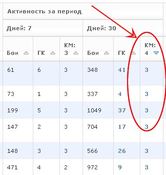
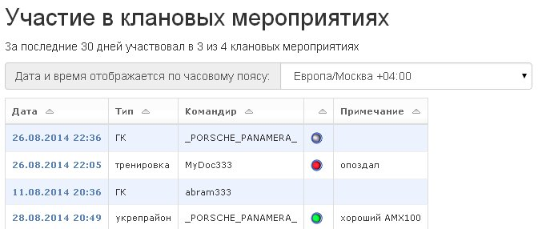
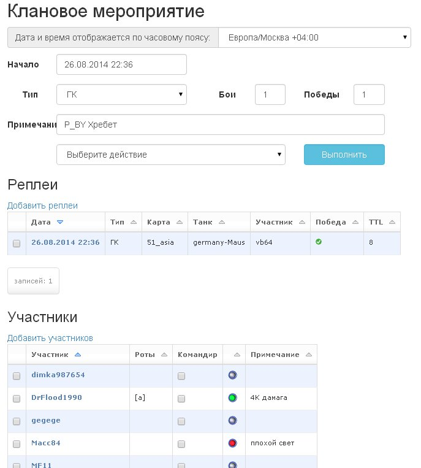
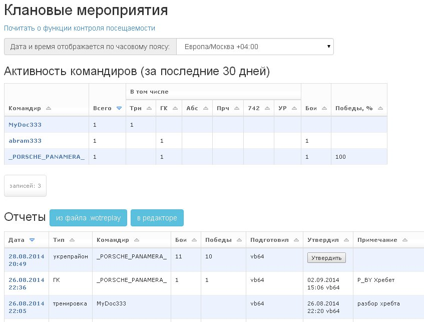

Посещаемость мероприятий
========================

При использовании данной функции вы можете контролировать посещаемость клановых мероприятий (тренировки, роты, ГК, 7/42) участниками клана.

В таблице участников клана в колонках "КМ" (клановые мероприятия) отображается количество мероприятий, в которых участвовал игрок в течение соответствующего периода.
Сортируя список участников по этой колонке, вы можете определить участников, принимающих активное участие в жизни клана, и участников, игнорирующих клановые мероприятия.

В разделе данных игрока в секции "Посещалка" отображается история участия игрока в клановых мероприятиях и полученные им положительные и отрицательные оценки.

В разделе клана в секции "Посещалка" отображается таблица активности командиров с данными о том, каким количеством мероприятий руководил командир. 
Если при создании отчетов о мероприятиях указывалось количество боев и побед, то для командиров также подсчитывается процент побед в боях, которыми они командовали.

Все эти данные берутся из отчетов о проведенных клановых мероприятиях, которые создаются в данном разделе.
Мероприятие может состоять из одного боя или из серии боев (например, турнир за высадку). Каждое мероприятие должно иметь одного командира.

Создание отчета о мероприятии займет минимум времени. 
Просто загрузите файл .wotreplay, отметьте в автоматически сформированном списке командира (или участника, проводившего тренировку) и нажмите кнопку "Сохранить".

Кроме того, при необходимости, вы можете отредактировать список (добавить/удалить участников), проставить положительные или отрицательные замечания участникам, загрузить дополнительные файлы .wotreplay.

Если вы загружаете реплеи в отчет о клановом мероприятии в "Посещалке", то для этих реплеев создаются страницы с расширенной статистикой и протоколом боевого чата записанного в реплее боя.
Перейти на такую страницу можно по ссылке с датой реплея в таблице реплеев в отчете о клановом мероприятии.

Страница с расширенной статистикой содержит списки команд со следующими данными для каждого участника:

* полученный боевой опыт
* фраги
* поврежденные и обнаруженные противники
* нанесенный урону
* урон по засвету
* выстрелы
* попадания
* пробития
* попадания сплешем
* потенциальный полученный урон
* пробег

Член руководства клана (командир/заместитель или должность из настраиваемого списка) должен утвердить отчет, нажав соответствующую кнопку, чтобы данные из созданного отчета начали учитываться в общей статистике клановых мероприятий.

