Пример использования функций управления ротами
==============================================

Представим, что вы являетесь полевым командиром SerB клана WG и перед вами поставлена задача сформировать боеспособную роту для боев на ГК. 
Первой целью является высадка на ГК на карте "Песчаная река".

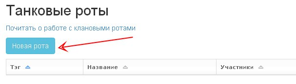

Авторизуемся на сайте, переходим на страницу клана WG и переходим в раздел "Управление". Жмем ссылку "Новая рота".

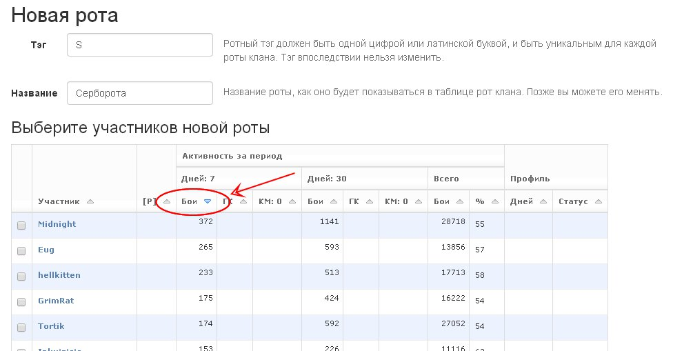

Ники все незнакомые, кто как играет вы не в курсе. 
Поэтому принимаете решение отобрать в состав роты аккаунты с наибольшим количеством боев за прошедшую неделю. 
Вам ведь не нужны в роте люди, играющие 10 боев за неделю, правда?

Сортируем таблицу участников клана по колонке "Активность за период", "Дней: 7", "Бои" в убывающем порядке, кликнув на заголовке этого столбца. 
Отмечаем галками в левой колонке первых 14 человек, дальше находим и отмечаем в списке себя. 
Задаем в соотв.полях тег и название роты и жмем кнопку "Сформировать роту" внизу страницы.

.. note::
   Данные об активности участников начинают накапливаться с момента добавления клана на сайт. 
   Если вы только что добавили свой клан на сайт, данные об активности будут недоступны.
   
   Полные данные об активности игроков за 7 и 30 дней будут доступны через неделю и месяц соответственно, с момента добавления клана на сайт.
   Кроме того, имеет значение как регулярно вы обновляете данные своего клана, если используется бесплатный режим обслуживания.
   
   В данном примере клан WG обслуживается с декабря 2012 года и обновление данных происходит автоматически ежедневно. 
   Так что вы располагаете полными и достоверными данными об активности игроков за указанные периоды.

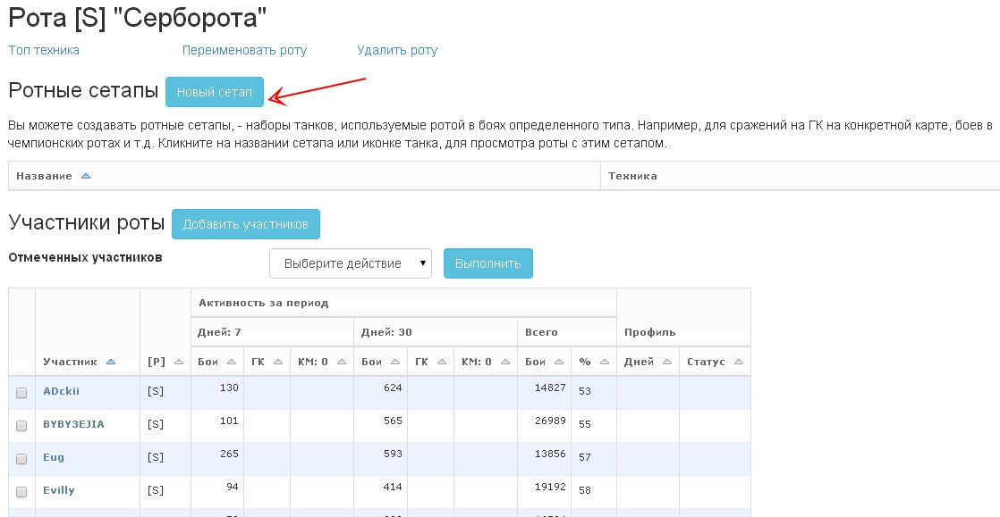

Вы переходите на страницу редактора роты. Теперь нужно определиться, на какой технике будет воевать ваша новая рота.

Допустим, для выполнения поставленной командованием задачи вы решили использовать следующий сетап: две арты "обьект 261", 3 батчата, 2 ПТ-САУ "обьект 268", 8 Т-62А. 
Жмем ссылку "Новый сетап".

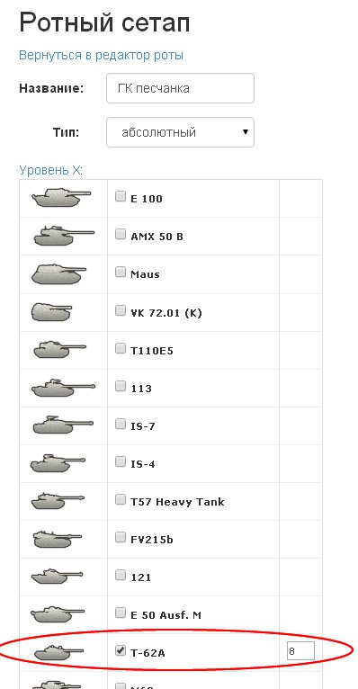

Раскрываем список техники X уровня, отмечаем галками выбранные танки, в появляющихся полях ввода указываем нужное количество. 
В поле "Название" вводим название этого сетапа, жмем кнопку "Сохранить" внизу страницы.

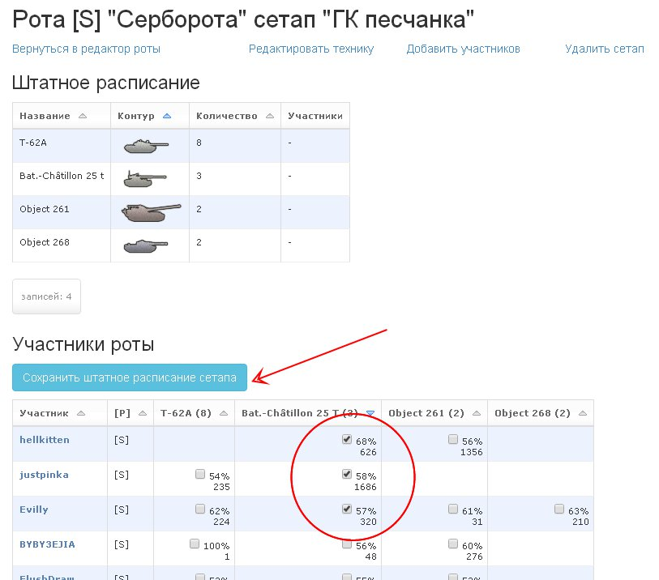

Попадаем на страницу редактирования ротного сетапа. 
Тут можно увидеть наличие техники из этого сетапа у участников роты и их навыки игры на этой технике (винрейт и кол-во боев).

Вам нужно решить, кто на какой технике будет играть. Начнем с батчатов. 
Отсортируем таблицу по винрейту на бачах, кликнув на заголовке столбца "Bat.-Chatillon 25 T". 
Назначаем батчат "профильным танком" для игроков hellkitten, justpinka и Evilly. 
Жмем кнопку "Сохранить штатное расписание сетапа".

Отмеченные нами игроки появляются в табличке "Штатное расписание", расположенной под таблицей "Участники роты".

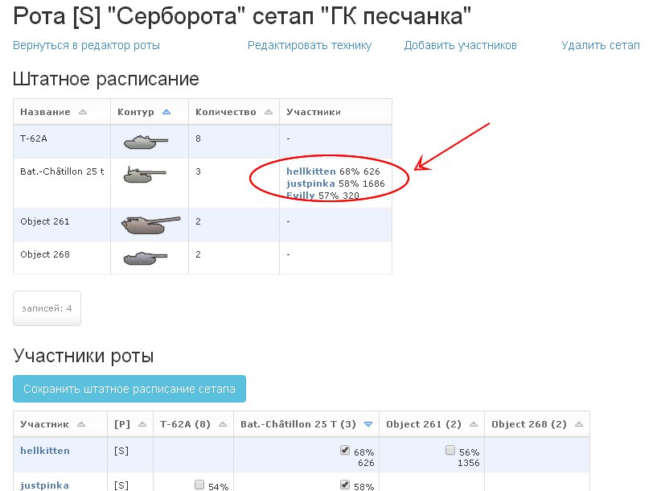

Повторяем эту процедуру для остальной техники нашего сетапа. В результате у нас получаются такие результаты.

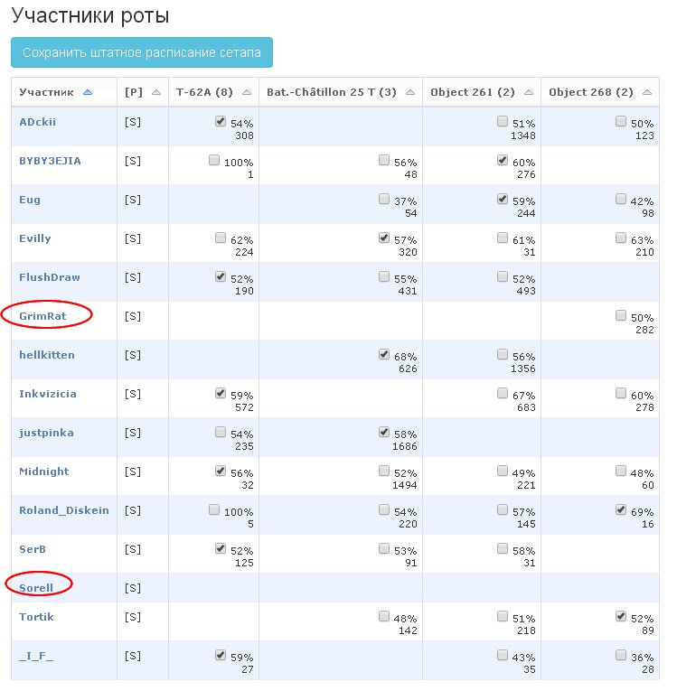

По арте, пт и батчатам рота укомплектована, не хватает двух Т-62А. 

В то же время игроки GrimRat и Sorell либо не имеют нужной техники, либо имеют на ней слишком низкие для вашей победоносной роты навыки.

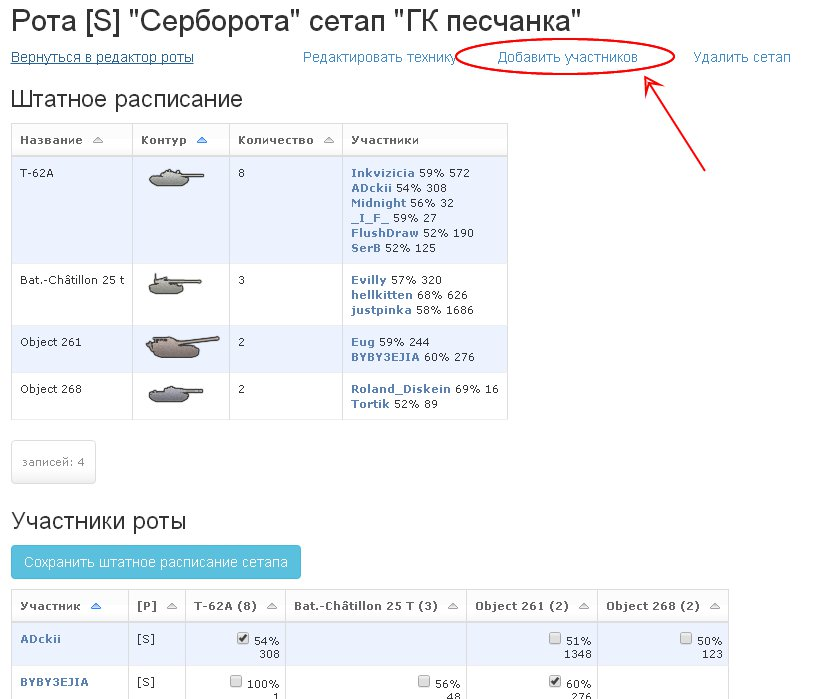

Нужно добрать людей для игры на двух ст. Жмем ссылку "Добавить участников".

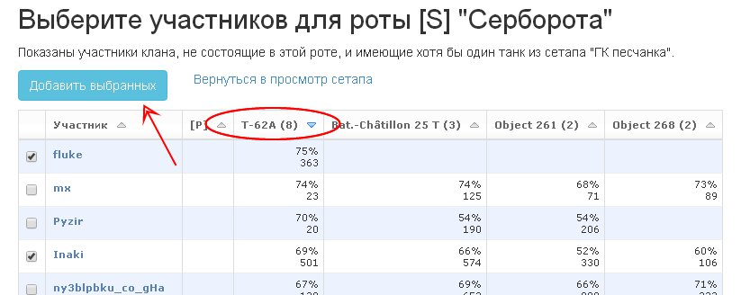

В открывшейся таблице перечислены все члены клана, которые не состоят в вашей роте и имеют хотя бы один танк из сетапа, с которым идет работа. 
Сортируем таблицу по колонке "T-62A", кликнув по заголовку этой колонки. 

Первые по винрейту на этом танке игроки имеют слишком малое число боев на данной технике, поэтому отмечаем игроков fluke и Inaki. 
Они имеют достаточное число боев на технике и приемлемый винрейт. 
Жмем кнопку "Добавить выбранных".

На странице редактирования сетапа находим в таблице новых участников роты и назначаем им профильным танком "T-62A", поставив галку в соотв.ячейке и 
нажав кнопку "Сохранить штатное расписание сетапа". 

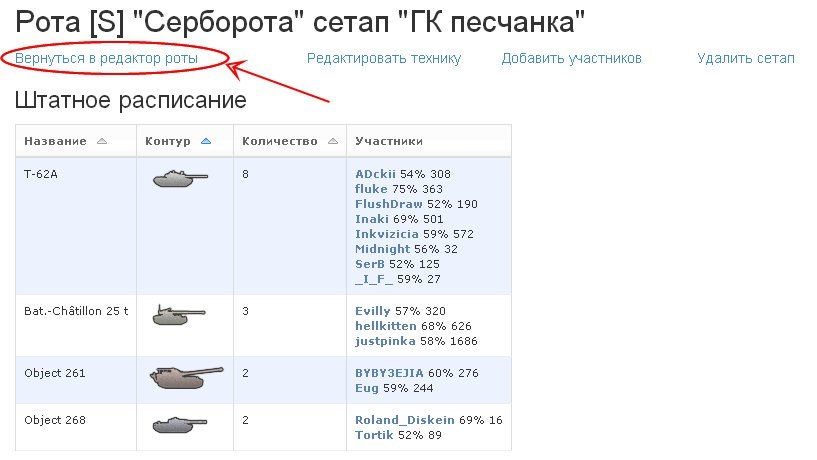

Теперь нужно безжалостно изгнать из роты "днищ", не вписывающихся в ваш победоносный состав. Жмем ссылку "Вернуться в редактор роты".

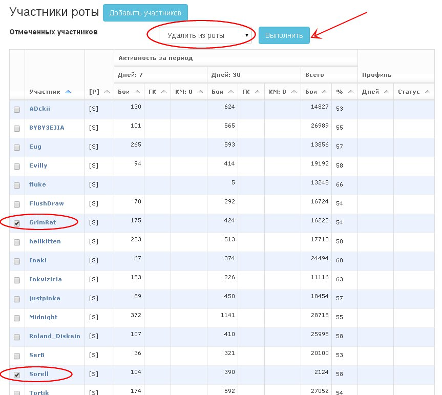

Отмечаем в левой колонке ненужных бойцов, выбираем в выпадающем списке "Удалить из роты" и жмем кнопку "Выполнить".

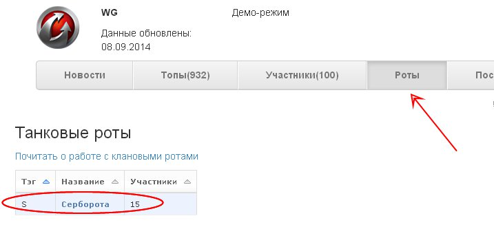

Переходим в общедоступный раздел "Роты", находим в таблице нашу роту, кликаем по ней, под таблицей участников находим таблицу ротных сетапов, 
кликаем на строке "ГК песчанка", любуемся на наш сетап.

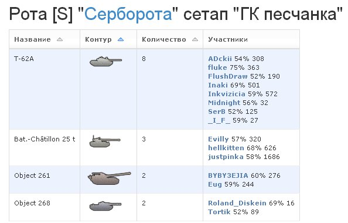

Публикуем ссылку на эту страничку на клановом форуме, чтобы оповестить участников о том, что они включены в состав новой роты и какие танки они должны подготовить для боев на ГК, 
закупив для них премиум снаряжение.

Задача, поставленная перед вами командованием клана выполнена. Рота готова к подвигам.

.. attention::
   Теги кланов, ники игроков и оценки их навыков, использованные в данном примере, являются художественным вымыслом, все совпадения случайны. 
