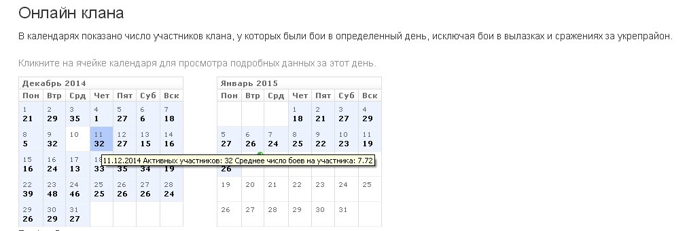
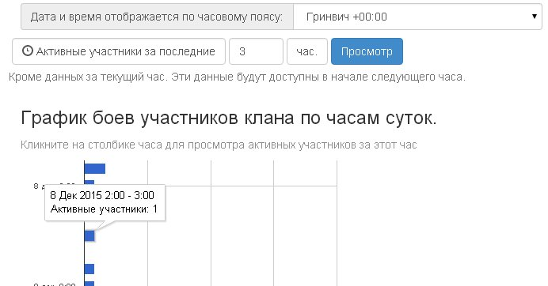
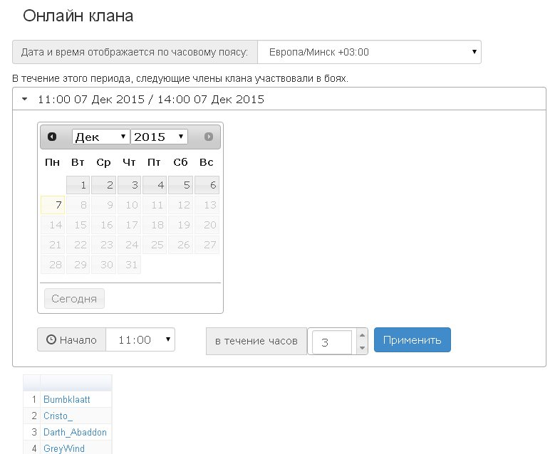
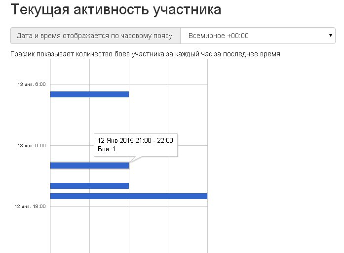

Статистика вільного онлайну клану
=================================

Для кланів, що обслуговуються в платних режимах ("Базовий" і "Преміум") на вкладці "Онлайн" доступна зведена інформація про щоденний онлайн клану.
В осередках днів календаря відображається кількість учасників клану, у яких був хоча б один бій в цей день.
При наведенні курсора миші на осередок дня, відображається підказка про середню кількість боїв у учасників клану в цей день.

Якщо ваш клан обслуговується в безкоштовному режимі, ви можете спробувати цю функцію, безкоштовно ввімкнувши для свого клану режим обслуговування "Базовий" на 30 днів.
Для цього командиру або заступнику потрібно авторизуватися на сайті клан-панелі через Wargaming OpenID і на сторінці свого клану натиснути кнопку "Безкоштовний тріал".
Якщо клан в минулому вже включав пробний період, то дана можливість недоступна.

Для кланів, які обслуговуються в режимі "Преміум", на вкладці "Онлайн" також доступна інформація про погодинному онлайн клану і віджет "Активні учасники за останні N годин".

Для кожної години за поточну і попередні добу графік відображає кількість учасників клану, у яких були бої протягом цієї години.
Графік оновлюється на початку кожної години. 

Аналогічний графік можна подивитися для будь-якого дня в минулому, починаючи з моменту включення для клану режиму "Преміум".
Для цього потрібно клікнути на обраному дні в календарі на вкладці "Онлайн".

Якщо клікнути на стовпчику години на графіку, можна побачити список гравців, у яких були бої протягом цієї години.
При перегляді результатів запиту можна вибрати довільний інтервал в годинах (розмір інтервалу не може перевищувати 24 години) для довільного дня,
якщо в цей день у клану преміум-режим обслуговування в клан-панелі був активним.

Імена гравців в цьому списку є посиланнями, перейшовши по яких, можна переглянути погодинний графік боїв потрібного гравця за обраний день.
Стовпчики графіка відображають кількість боїв, проведених учасником за кожну годину. 

Крім того, аналогічний графік для поточної і попередніх доби, доступний на вкладці "Онлайн" в розділі даних про акаунт гравця.
