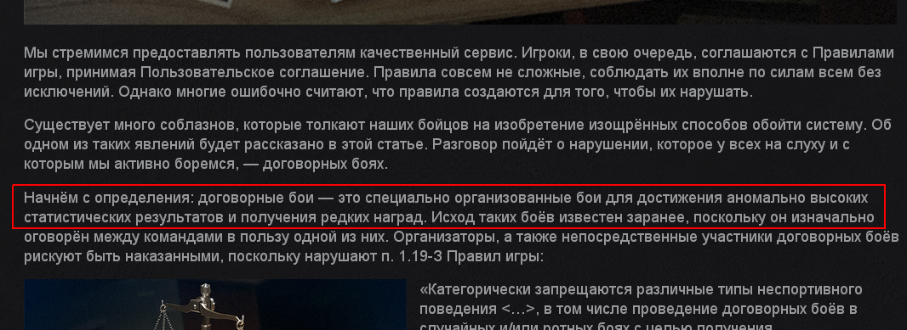
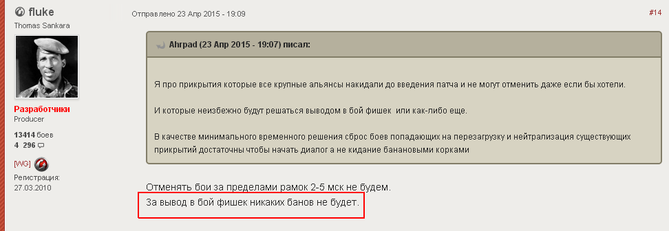

FAQ Питання і відповіді
=======================

Чому клан [XXX] в моїх завданнях записаний два дні підряд?
----------------------------------------------------------

Якщо поставити прикриття на будь-який з днів, то останні завдання по прикриттю цього клану пропадуть із списку, коли дані про поставлену атаку з'являться на сайті Wargaming і будуть прочитані клан-панеллю.  
Вони фільтруватимуться по умові "на клан вже є заплановані атаки". В останніх кланів другий (неприкритий вами) день в завданнях залишиться.

Можливий варіант, що якийсь клан не буде прикритий? На нього просто не поставлять прикриття.
--------------------------------------------------------------------------------------------

Цей варіант можливий лише у тому випадку, коли ні у кого не буде технічної можливості прикрити.  
Реальних причин такої ситуації можливо лише дві: мало учасників в союзі або коли багато кланів в одному праймі.

Якщо у когось є технічна можливість кинути прикриття, то в тих, хто може, воно буде відображено в завданнях.  
Не прикритий, натиснувши в своєму розкладі захисту по неприкритому дню, дізнається хто його може прикрити.

Перейшов по посиланню, яке мені дав інший учасник союзу, а воно мені пише "Адміністрація клану дозволила переглядати цю сторінку лише учасникам клану." Що робити?
------------------------------------------------------------------------------------------------------------------------------------------------------------------

Посилання, яке вам дали, швидше за все веде в розділ для клану тієї людини, яка дала вам посилання.  
Це все одно що намагатися перейти за посиланням, ведучій в "Особистий кабінет" на порталі WG.  
Окрім власника, попасти туди не зможе ніхто.

Вам потрібно перейти в розділ СВОГО клану. Для цього є універсальна процедура, яка підійде всім.

* зайти на сайт клан-панель
* авторизуватися через посилання "Увійти" справа зверху сторінки
* перейти на вкладку "Укріпрайон"
* клікнути зелену кнопку "Завдання для клану" (доступна лише офіцерам кланів)

Після авторизації в клані-панелі немає зеленої кнопки "Завдання для клану" на вкладці "Укріпрайон", хоча я зам.командира клану. Чому?
-------------------------------------------------------------------------------------------------------------------------------------

Найчастіше так трапляється, коли дані вашого клану в клан-панелі сильно застаріли і не відповідають вашій поточній посаді в клані.

Зверніть увагу на значення поля "Дані оновлені:" поряд з емблемою клану.  
Склад клану і зміни посад учасників клану запам'ятовуються після кожного оновлення.   
Якщо останнє оновлення було досить давно, натисніть кнопку "Відновити дані" у верхній частині сторінки.  
Дані клану оновляться протягом доби і наступного дня кнопка "Завдання для клану" на вкладці "Укріпрайон" буде вам доступна.

Не забувайте надалі періодично натискати кнопку "Відновити дані", щоб підтримувати дані свого клану в актуальному стані.

Крім того, можна попросити когось з керівництва клану, хто на даний момент має доступ до розділу "Управління", авторизуватися на сайті, зайти в розділ "Управління" і натискати кнопку "Відновити список учасників і їх посад". 
В цьому випадку клан-панель відразу відновить склад клану без збору даних для статистики.

А нас не забанять за такі прикриття, як за договірні бої?
---------------------------------------------------------

По-перше, бої-прикриття укріпрайонів не потрапляють під визначення "договірного бою"

По-друге, розробники дали пряму відповідь на це питання.

